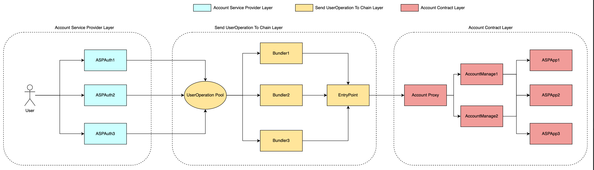

## 1 Third-party account applications layer (ASP) (Off-chain):

- Third-party account service providers upload their smart contract account applications implemented in user account contracts (store the source code somewhere and provide the address of source code)
- Third-party account service providers can also upload the corresponding off-chain user client for their account applications for users to download (optional)
- Users can choose and get third-party account applications and install them in their account contract
- Different applications have command standards for utilizing user data under authoriztion

## 2 Account abstraction layer (AA)(SUTC) (ERC-4337)

- UserOperation Pool
- Bundler
- EntryPoint

## 3 User Account Contract Layer(AC):

- AccountContract: user account contract
- The smart contract of third-party account applications users choose will be installed and run here like:
    - ASPAuth: Account login and recovery
    - ASPApp: ASP Application: User assets and account management
    - ....
- The local smart contract of third-party account applications on the user account contract side can connect to the smart contract account of applications and off-chain account applications (optional)
- User data and assets will be stored in their account contract universal and applicable for all other applications to read and use under authorization

    For example, after a user chooses and installs an account login application like 2FA, he can first open the 2FA login app on his phone and finish the verification requirements he previously set. Then the login application will transmit the login request authorized by the user to the account abstraction on chain, and then send it to the corresponding account contract of the user. The account contract will find the corresponding on-chain user login data and send the data to the 2FA login smart contract account application stored in user account contract. The application will verify the login request and allow the user to login.  
