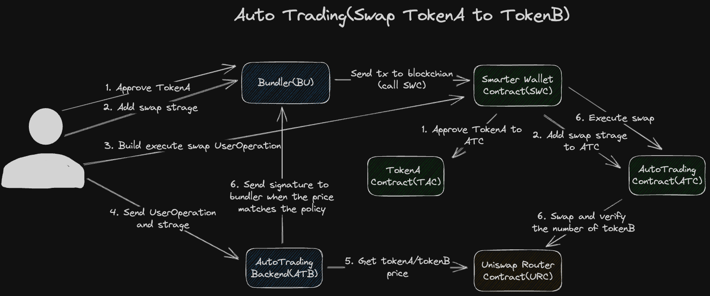

# 1. Introduction

The product we present in this section is an innovative trading platform designed for investors who wish to automate their trading. Whether you are an experienced trader or a novice just getting started with trading, this product can help you manage and execute your trading strategies more efficiently. Our target user groups include individual investors, institutional investors, and developers interested in automated trading.

# 2. Automated Trading

## 2.1 Setting up Trading Strategies

On our platform, users can set up trading rules based on their trading strategy and risk appetite. This includes setting buy and sell price points, volume, and possibly other parameters. For example, a user can set a rule to automatically buy when the price of a particular cryptocurrency falls to a certain level, or automatically sell when the price rises to a certain level. These rules can be adjusted and optimized according to market conditions.

## 2.2 Executing Trades

When the trading rules set by the user are met, the system will automatically execute the trade. This means that the user does not need to keep an eye on the market or execute trades manually. This greatly reduces the stress of trading for the user and also reduces the delays and errors that may occur due to manual trading. In addition, our system also provides detailed trade reports so that users can clearly understand the details of each trade.

# 3. Uniswap Interaction

Our product also provides the ability to interact with Uniswap, an Ether-based decentralized trading platform that allows users to trade a variety of different cryptocurrencies. With our product, users can trade Uniswap directly on our platform without having to jump to other websites or applications. Our system automatically handles all transaction details, including price inquiries, trade execution, and trade confirmations. This provides users with a more convenient and efficient way to trade.

# 4. Security

Our product understands the importance of security for a trading platform, therefore we have adopted a series of security measures to protect users' funds and information. Firstly, we use the most advanced encryption technology to protect users' data and ensure its security during transmission and storage. Secondly, our system is subject to regular security checks and updates to prevent any possible security threats. In addition, we provide multiple authentication features to increase account security. Lastly, our team consists of a group of experts with extensive security experience, who will always monitor the system's operation to detect and deal with any possible problems in a timely manner.

# 5. Technical Architecture

We look forward to your use and feedback as we continue to improve and optimize our product to provide better service.