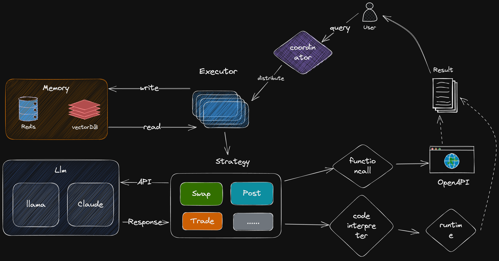

In order to realize the requirement abstraction, we propose a policy processing model called **SmarterGPT** model.
# What is SmarterGPT?

- Supports access to open source, closed source, finetune and other large models
- Based on Code Interpreter + FunctionCall capability, it can provide the clearest interpretation and the most accurate execution of user requirements.
- Adaptation of SmarterWallet's integrated Swap, Trade, Post and other strategies, connecting Web2 and Web3, and lowering the threshold of Web3 for users.
- AI distributed execution framework for efficient task execution and powerful extensibility.

# Technical Framework

Distributed scheduling framework is divided into scheduling layer, strategy layer and execution layer:

- **Scheduling Layer**: Coordinator decomposes the tasks for the user's requirements, and divides the tasks into multiple schedulable and organizable subtasks through LLM, which are handed over to the sub-node Executor for execution.
- **Strategy Layer**: Sub-nodes map sub-tasks to wallet-integrated policies, such as Trade Post Swap, etc. Multiple sub-nodes can access Memory, record and read the necessary context information Context
- **Execution Layer**: Depending on the policy, SmarterGPT supports various LLM capabilities such as FunctionCall, Code interpreter, etc., combined with the Al interpreter and Web2 OpenAPI to fulfill the execution of user requirements.