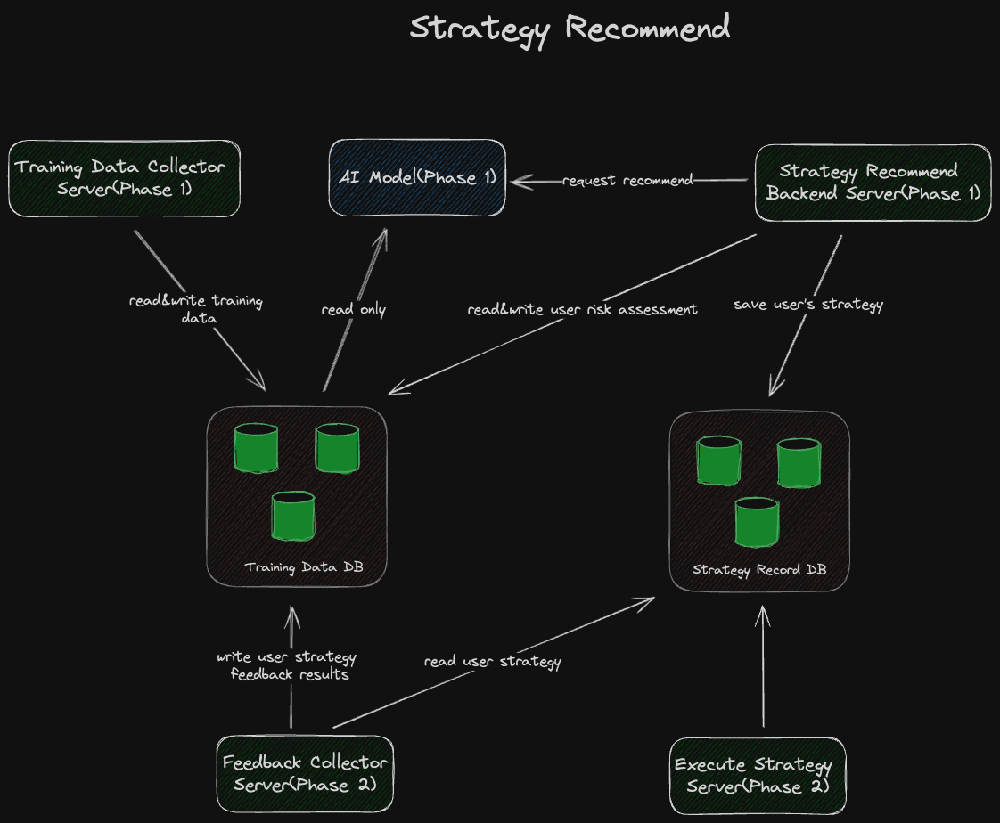

# Strategy Recommendation: AI-Powered Blockchain Account Abstraction Wallet DApps

## 1. Overview

"Strategy Recommendation" is a sophisticated DApp (Decentralized Application) designed for blockchain account abstraction wallets, utilizing artificial intelligence to deliver personalized investment strategies. This application intelligently recommends strategies that align with the user's return expectations by analyzing blockchain strategy performance data.

## 2. Functional Modules

### 2.1 Data Collection

The data collection module is responsible for gathering a wide array of strategy execution data on the blockchain, including:

- Historical performance of trading strategies
- Market volatility indicators
- Records of user asset allocation
- Market sentiment analysis related to strategies
- Real-time transaction flow data

Prior to being fed into the AI model, this data undergoes rigorous cleansing and preprocessing.

### 2.2 Feedback Loop

The feedback loop module is crucial for collecting user feedback on the recommended strategies, which encompasses:

- User satisfaction with strategy recommendations
- Actual investment returns of the recommended strategies
- User feedback on the outcomes of strategy execution

This feedback is vital for the continuous iteration and enhancement of the model.

### 2.3 Strategy Execution

The strategy execution module transforms AI-generated strategy recommendations into concrete execution plans facilitated by the account abstraction wallet, which includes:

- Generation and validation of execution plans
- Automated execution and monitoring of transactions
- Dynamic adjustment and risk control of strategies

The execution plans via the account abstraction wallet ensure seamless and secure execution of recommended strategies within the blockchain ecosystem.

### 2.4 AI Model

The AI model is the heart of the application, encompassing the following steps:

1. **Model Training**: Utilizing vast historical data to train models to discern the intrinsic link between strategies and returns.
2. **Model Evaluation**: Assessing the model's performance through validation and test sets to ensure predictive robustness.
3. **Model Optimization**: Refining the model based on user feedback to enhance the precision of strategy recommendations.
4. **Recommendation Generation**: Creating personalized investment strategy recommendations based on user-defined return expectations using the trained model.

## 3. Technical Architecture

- **Training Data DB And Strategy Record DB**: Utilizing distributed database technology to ensure secure and efficient data storage.
- **AI Model And Computational Framework**: Incorporating high-performance computing frameworks to support complex data processing and model computation.
- **Execute Strategy**: Implementing automated strategy execution through account abstraction wallet execution plans.
- **Strategy Recommend Backend**: Providing an intuitive interface for users to set investment preferences and manage recommended strategies.
- **Traning Data Collector**: The data collector is a specialized component engineered to aggregate and process diverse streams of blockchain data. It is optimized for high-throughput and low-latency operations to capture real-time market dynamics and strategy performance metrics. The data collector ensures that the AI models have access to the most current and relevant data for analysis.
- **Feedback Collector**: The feedback collector is a critical module that systematically captures and processes user feedback on strategy recommendations. It is designed to parse qualitative and quantitative feedback, enabling the AI models to refine and personalize the investment strategies based on user experiences and outcomes. This component is essential for the adaptive learning capabilities of the system, ensuring that the strategies evolve with the user's needs and market conditions.

## 4. Security

- **Data Encryption**: Encrypting all data in transit and at rest to safeguard user information.
- **Access Control**: Implementing stringent access control measures to ensure that only authorized users can access their data.

## 5. Conclusion

With its advanced AI capabilities and deep integration with blockchain account abstraction wallets, the "Strategy Recommendation" DApp offers a smart and secure investment strategy recommendation service. By continuously learning from user feedback and market data, the application consistently improves the accuracy of its recommended strategies, helping users achieve their investment objectives.