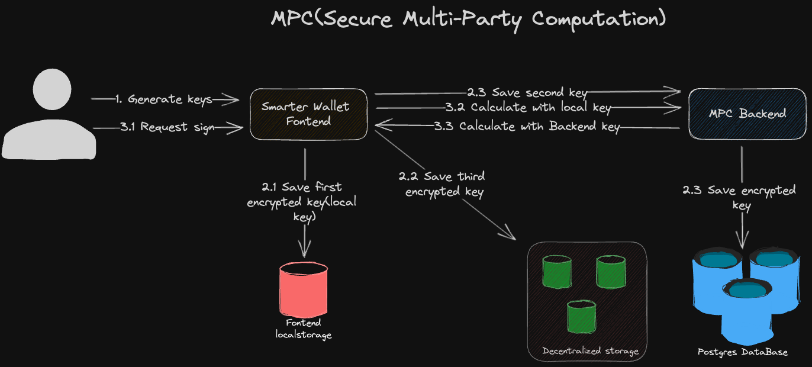

# 1. Introduction

The purpose of this document is to outline the design and implementation details of a MPC Signature technology using ECDSA (Elliptic Curve Digital Signature Algorithm). The system consists of a web client and a server, each with specific roles and responsibilities. This document will provide an overview of the system architecture, key components, and their interactions.

# 2. System Architecture

The MPC Signature system comprises the following components:

## 2.1 Frontend

- Responsible for interacting with users through a web interface.
- Generates and manages user key pairs.
- Initiates signature generation and verification processes.
- Communicates with the server to perform all operations.

## 2.2 MPC Backend

- Manages the MPC signature scheme.
- Stores the necessary cryptographic keys.
- Performs cryptographic operations in collaboration with the fontend.
- Ensures the security and integrity of the system.

# 3. Key Generation

The key generation process involves the following steps:

## 3.1 Frontend

- Generates three private key using go wasm code.
- Share private key to your partner or server
- Calculate your ETH address with others

## 3.2 MPC Backend

- Nothing to do when generating key(it must be so)

# 4. MPC Signature Generation
The mpc signature generation process involves the following steps:

## 4.1 Frontend

- Calculate transaction hash
- Client calculates the elliptic curve point (k1*G,public key) based on k1
- Client zk schnorr verifies the receiver's proof and then gives a k1*G promise
- Client decrypts the signature using the homomorphic encryption algorithm and verifies that the signature is correct

## 4.2 MPC Backend

- Server computes the elliptic curve point (k2*G,public key) based on k2 and gives the commitment of k2*G
- Server zk schnorr verifies the initiator's proof and then computes the signed cipher

# 5. Security Considerations
To ensure the security of the MPC Signature system, the following measures should be implemented:

## 5.1 Key Protection

- Private keys should be stored securely and protected against unauthorized access.
- Communication channels between the web client and server should be encrypted using secure protocols.

## 5.2 Key Distribution

- The server should use secure channels to distribute partial private keys to participating entities.
- Proper authentication mechanisms should be implemented to prevent unauthorized access to the server.